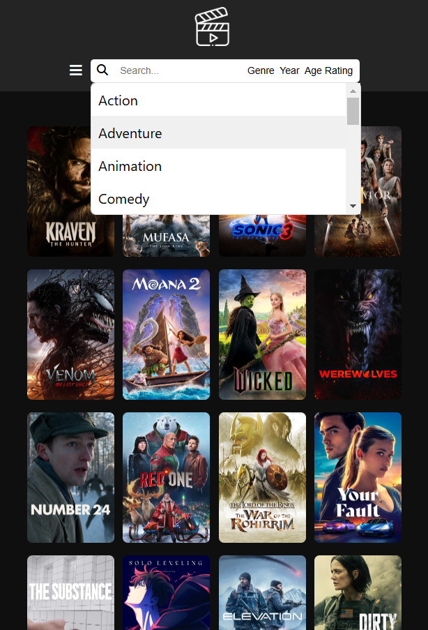
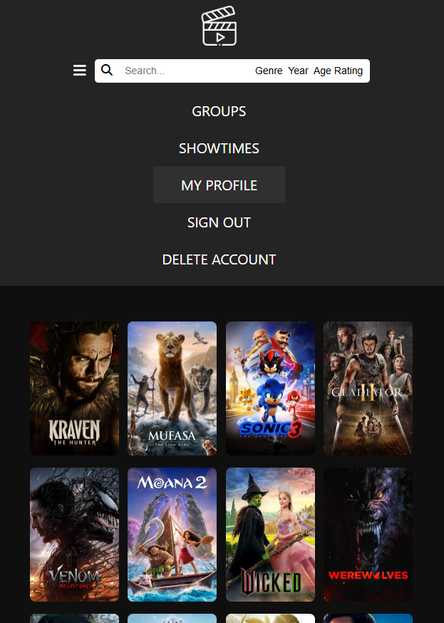
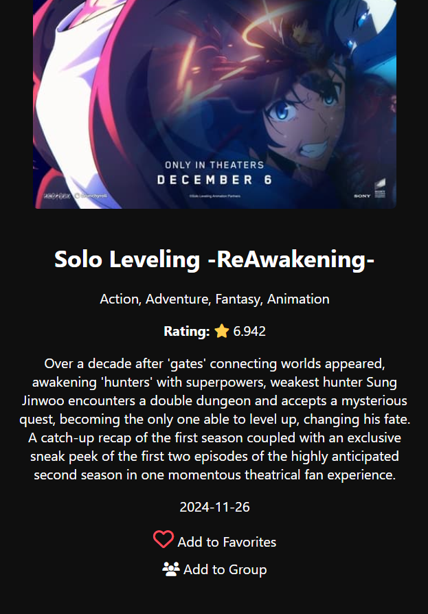
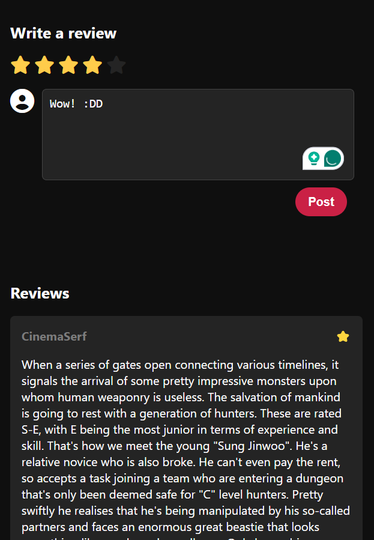
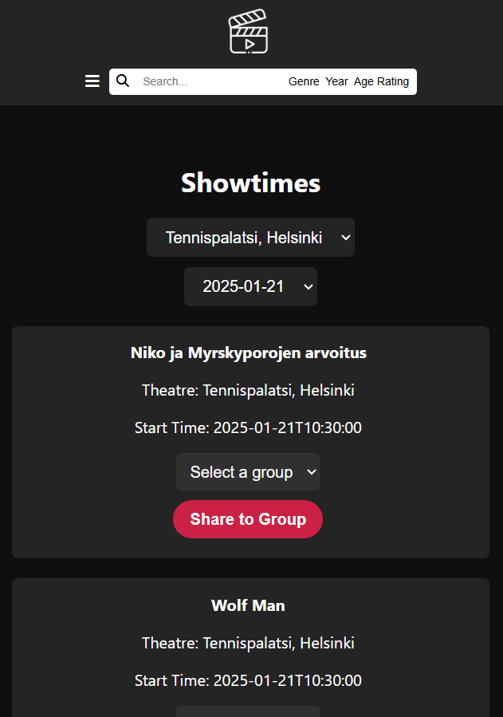
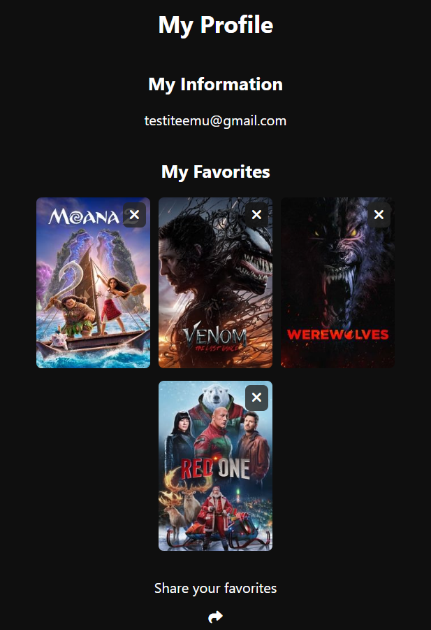
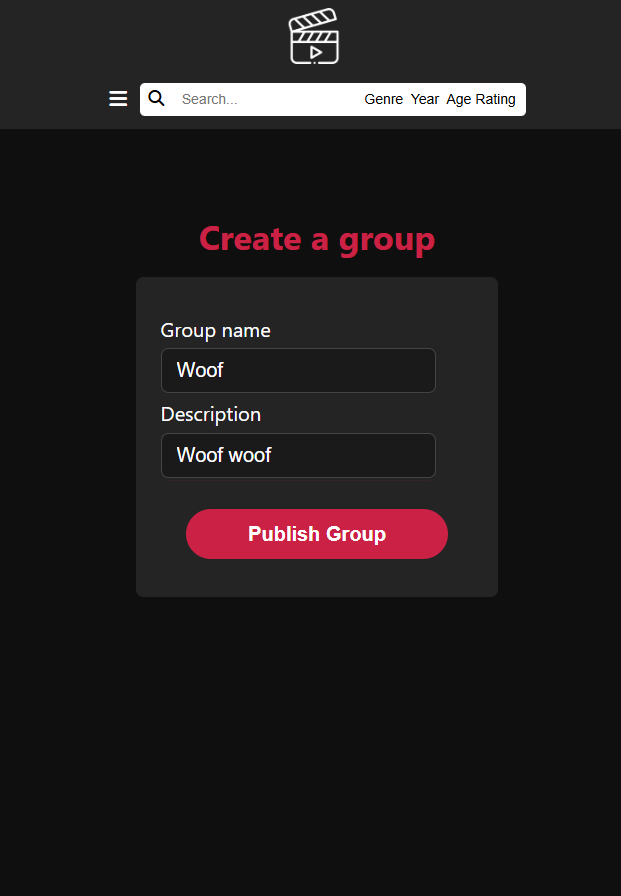
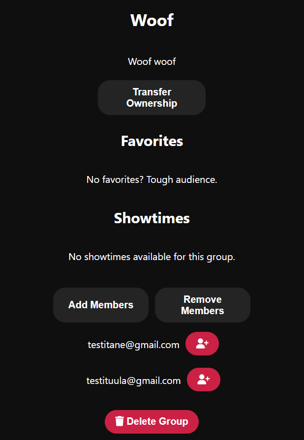
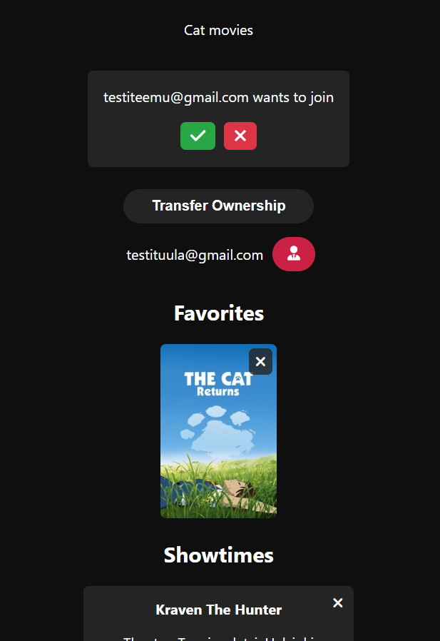

# Movie Web Appllication
This was a second-year group project with the goal of developing a movie web application. The application allows users to browse and search for movies, view and filter showtimes, read and leave reviews, add movies to a favorites list, and share them within a group of like-minded individuals.

The movie data and some reviews were fetched from The Movie Database API, while showtime information came from Finnkino’s open API. The movies and showtimes are not connected in the application.

# Participants
[@KarolusPaulus](https://github.com/KarolusPaulus): Project management & full-stack development​.

[@Tappivanukas2](https://github.com/Tappivanukas2): Backend development & database management​.

[@nidacnr](https://github.com/nidacnr): Frontend focused full-stack development​.

[@himavirveli](https://github.com/himavirveli): Backend development & database management​.

# Tools and Languages
The project was built using React and JavaScript for the frontend, with JavaScript also powering the backend. PostgreSQL was used for the database, and CSS for the UI. The database, backend, and frontend were all hosted on Render. Unfortunately, the database is currently offline due to hosting costs, which means the application is temporarily non-functional as we search for a new host for it.

# Demo Video of The Desktop Version
### In English

# Mobile Version Samples
### Taken on desktop

# More Info
The Documents folder in the movie-web-app folder contains the ERD for the
database (initial plan and current version), and UI documentation.

REST API Documentation https://documenter.getpostman.com/view/40323537/2sAYBd8okg

Render https://movie-app-frontend-5ivy.onrender.com/ (Database OFFLINE)